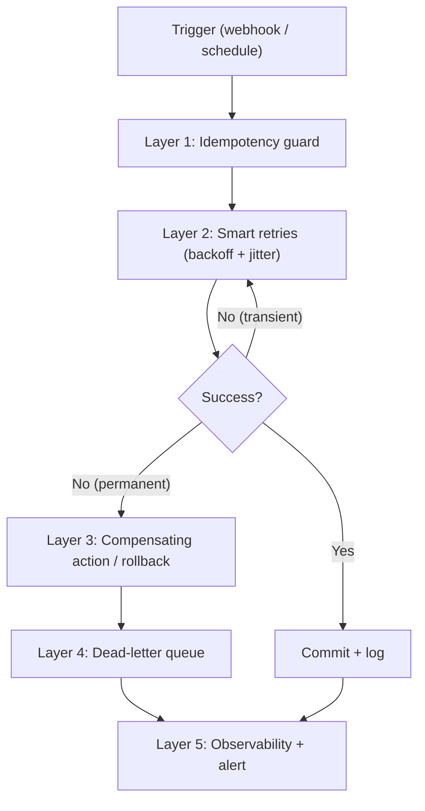

<aside>
🔍

**SEO Package**

- **Focus Keyword:** self-healing n8n workflows
- **Secondary Keywords:** n8n error handling, n8n rollback playbook, n8n retry on fail, idempotency in n8n, compensating actions, dead letter queue n8n, self-hosted n8n reliability, production n8n best practices
- **Semantic / Entity Keywords:** exponential backoff with jitter, error trigger node, transactional workflow, observability, alerting, error budget, n8n queue mode, webhook, retry policy
- **Meta Title:** Self-Healing n8n Workflows: 2026 Production Playbook
- **Meta Description:** Build self-healing n8n workflows in 2026: retries with backoff, idempotency, compensating actions, dead-letter queues, and a copy-paste production recovery checklist.
- **Slug:** /blog/self-healing-n8n-workflows
- **Canonical URL:** https://aifloxium.online/blog/self-healing-n8n-workflows
- **Author:** Muhammad Shadab Shams
- **Published:** June 2026
- **Last Updated:** June 5, 2026
- **Word Count Target:** 3,200
- **Content Type:** How-to / Tutorial (with comparison + FAQ blocks for AEO/GEO)
</aside>

!Self-Healing n8n Workflows — a broken automation node regenerating and reconnecting itself with streams of green code, 2026 production playbook banner

Self-Healing n8n Workflows — a broken automation node regenerating and reconnecting itself with streams of green code, 2026 production playbook banner

<aside>
✅

**Written by Muhammad Shadab Shams** — Software Engineer & AI Automation Expert at AIFLOXIUM. I architect production-grade, self-hosted automation systems on n8n (Docker/VPS) with version control, error budgets, and rollback plans. Every pattern below comes from workflows I run in production for real B2B clients — not theory.

LinkedIn · X / Twitter · GitHub · AIFLOXIUM

</aside>

<aside>
⚡

**Quick answer:** A self-healing n8n workflow is one that detects its own failures and recovers automatically — through retries with exponential backoff, idempotency keys, compensating actions (rollbacks), and a dead-letter queue — instead of silently breaking and corrupting data. You build it by layering five things: smart retries, idempotency, a global error workflow, compensating rollbacks, and observability with alerting.

</aside>

## What this guide covers

- What "self-healing" actually means for an n8n automation (plain-English definition)
- The 7 ways production n8n workflows break — and the recovery pattern for each
- The 5-layer self-healing architecture you can copy today
- Copy-paste **retry + exponential backoff with jitter** logic
- How to make any workflow **idempotent** so retries never double-charge or double-send
- **Compensating actions**: how to roll back a half-finished workflow cleanly
- A global **error workflow** + **dead-letter queue** pattern
- Observability, alerting, and an **error budget** approach
- A naive-vs-self-healing comparison table and a ready-to-run readiness checklist
- FAQ optimized for AI answer engines (ChatGPT, Perplexity, Google AI Overviews)

---

## What are self-healing n8n workflows?

**A self-healing n8n workflow is an automation that can detect a failure, recover from it automatically, and return to a correct state without a human stepping in.** Instead of stopping at the first failed HTTP call or corrupting downstream data, it retries transient errors, skips or quarantines bad records, undoes partial work when needed, and alerts you only when human judgment is genuinely required.

Think of the difference this way:

- A **fragile workflow** is a straight line of nodes. One node fails, the whole execution dies, and you find out hours later when a client asks where their invoice is.
- A **self-healing workflow** treats every external call as something that *will* eventually fail, and has a pre-decided answer to the question: *"What happens when this breaks?"*

That single question — answered in writing before you ship — is the foundation of every reliable automation I run at AIFLOXIUM.

---

## Why n8n workflows break in production (the 7 failure modes)

Most tutorials show you the happy path. Production is where the happy path goes to die. Here are the seven failures I see most often, and the self-healing response for each.

| Failure mode | What it looks like | Self-healing response |
| --- | --- | --- |
| Transient API error (5xx) | Upstream service times out or returns 502/503 | Retry with exponential backoff + jitter |
| Rate limit (429) | "Too many requests" from an API | Back off using Retry-After header, then resume |
| Expired credentials (401) | OAuth token expired mid-run | Refresh token, then retry once |
| Malformed data (422) | A record fails validation | Route to dead-letter queue for manual review — never retry |
| Partial completion | Step 3 of 5 fails after side effects already happened | Trigger compensating action (rollback) |
| Duplicate trigger | Webhook fires twice; record processed twice | Idempotency key blocks the duplicate |
| Silent stall | Workflow hangs, no error, nothing alerts | Heartbeat / timeout monitor + alert |

Notice the pattern: **not every error should be retried.** Retrying a 422 (bad data) forever just burns executions and hides the real problem. Self-healing is about matching the *right* recovery to the *right* failure.

---

## The 5-layer self-healing architecture

Every resilient automation I build stacks these five layers. You don't need all five on day one, but mission-critical workflows need every layer.



1. **Idempotency guard** — block duplicate processing before any side effect happens.
2. **Smart retries** — absorb transient failures automatically.
3. **Compensating actions** — undo partial work when a step permanently fails.
4. **Dead-letter queue (DLQ)** — quarantine records that can't be processed, so the pipeline keeps moving.
5. **Observability + alerting** — measure failures against an error budget and notify a human only when it matters.

---

## Layer 1: Idempotency — the most-skipped reliability pattern

**Idempotency means running the same operation twice produces the same result as running it once.** Without it, retries and duplicate webhooks become double charges, duplicate emails, and duplicate database rows — the exact "corruption" that makes teams afraid to automate.

The fix: derive a deterministic **idempotency key** from the event itself, store it, and check it before doing anything with side effects.

```jsx
// Code node — generate a deterministic idempotency key
const crypto = require('crypto');

const key = crypto
	.createHash('sha256')
	.update(`${$json.orderId}:${$json.eventType}`)
	.digest('hex');

return [{ json: { ...$json, idempotencyKey: key } }];
```

Then, before the side-effecting node, look the key up in a store (Postgres, Redis, NocoDB, or even a Data Table). If it exists, short-circuit and stop. If it doesn't, process the record and write the key.

> **My take:** Idempotency is the single highest-ROI reliability pattern. It is boring, invisible, and it has saved me from refunding clients more times than any fancy AI node ever has.
> 

---

## Layer 2: Smart retries with exponential backoff and jitter

n8n ships with **Retry On Fail** in every node's Settings tab — turn it on for any node that touches the network. But the built-in fixed retry isn't enough for high-stakes workflows, because a fixed 1-second retry hammers a struggling API and can cause a thundering-herd problem.

The production-grade approach is **exponential backoff with jitter**: wait longer after each failure, and randomize the wait so retries don't synchronize.

```jsx
// Code node — exponential backoff with jitter
const attempt = $json.attempt ?? 1;
const maxAttempts = 5;
const base = 1000;     // 1 second
const cap = 60000;     // 60 second ceiling

if (attempt > maxAttempts) {
	throw new Error('Max retries exceeded — route to dead-letter queue');
}

const expo = Math.min(cap, base * 2 ** attempt);
const waitMs = Math.floor(Math.random() * expo); // full jitter

return [{ json: { ...$json, attempt: attempt + 1, waitMs } }];
```

Pair this with a **Wait** node (set to the `waitMs` value) and loop back to the failing node. Map HTTP status codes to a clear policy so you never retry something that can't succeed:

| Status code | Meaning | Action |
| --- | --- | --- |
| 500 / 502 / 503 / 504 | Server / gateway error | Retry with backoff |
| 429 | Rate limited | Honor Retry-After, then retry |
| 401 | Unauthorized | Refresh credential, retry once |
| 422 / 400 | Bad / malformed data | Do not retry — send to DLQ |
| 404 | Not found | Fail fast, alert |

n8n's newer **"Continue (using error output)"** option on a node lets you branch failed items down a separate path — perfect for routing permanent failures to your DLQ while successful items continue.

---

## Layer 3: Compensating actions (the rollback playbook)

n8n has no native database-style transaction. If your workflow creates a Stripe customer, then writes to your CRM, and the CRM write fails — the Stripe customer still exists. That's a partial completion, and it's how automations quietly corrupt state.

The grown-up solution is a **compensating action**: for every step that causes a side effect, define the inverse step that undoes it. When a later step fails permanently, run the inverse steps in reverse order.

- Created a Stripe customer → **delete / archive the Stripe customer**
- Sent a "welcome" email → **send a correction / suppress follow-up**
- Inserted a CRM row → **mark it `rollback` or delete it**
- Reserved inventory → **release the reservation**

In n8n, implement this as a dedicated **"Rollback" sub-workflow** that takes the list of completed steps as input and fires the matching compensating call for each. Trigger it from your error path. This is the difference between a workflow that fails *safely* and one that fails *expensively*.

> **In my production stack:** every workflow that touches money or customer records carries a `completedSteps` array in its item data. If anything blows up, the rollback sub-workflow reads that array and reverses exactly what happened — no more, no less.
> 

---

## Layer 4: The global error workflow + dead-letter queue

n8n lets you assign an **Error Workflow** in **Workflow Settings**. It runs automatically whenever the main workflow fails, and it must start with the **Error Trigger** node. This is your safety net for everything the inline retries didn't catch.

A solid error workflow does three things:

1. **Captures** the failed execution (workflow name, node, error message, input data).
2. **Routes** the failed record to a **dead-letter queue** — a database table or queue holding everything that needs manual review — so the main pipeline isn't blocked.
3. **Alerts** a human via Slack, email, or Telegram, with a link straight to the failed execution.

```jsx
// Error workflow — Code node after the Error Trigger
const e = $json;

return [{
	json: {
		workflow: e.workflow?.name,
		failedNode: e.execution?.lastNodeExecuted,
		message: e.execution?.error?.message ?? 'Unknown error',
		executionUrl: e.execution?.url,
		timestamp: new Date().toISOString(),
		status: 'dead_letter',
	},
}];
```

Reprocessing the DLQ is then its own scheduled workflow: pull `dead_letter` rows, attempt them again now that the underlying issue may be fixed, and mark them `resolved` or escalate.

---

## Layer 5: Observability and the error budget

You cannot heal what you cannot see. **Observability** means every execution emits enough signal to answer: did it succeed, how long did it take, and if it failed, why?

Practical, self-hosted-friendly observability for n8n:

- **Heartbeat monitors** for scheduled workflows (e.g., Healthchecks.io) so a silent stall pages you.
- **Structured logs** to Postgres or a logging stack, with execution IDs you can search.
- **A metrics dashboard** counting successes, retries, DLQ entries, and rollbacks per workflow.
- **An error budget**: decide the acceptable failure rate (say, 0.5% of executions). Below budget, the system self-heals silently. Above budget, you get alerted and you stop shipping changes until it's back under control.

The error-budget mindset is what separates an automation hobby from an automation *operation*. It tells you when to relax and when to act.

---

## Naive workflow vs. self-healing workflow

| Dimension | Naive workflow | Self-healing workflow |
| --- | --- | --- |
| Transient API error | Execution dies | Retries with backoff, recovers |
| Duplicate trigger | Double-processes the record | Idempotency key blocks it |
| Partial failure | Corrupt, half-done state | Compensating rollback restores state |
| Bad record | Blocks the whole batch | Quarantined in DLQ, batch continues |
| You find out about failures | When a client complains | Instantly, via alert with a fix link |
| Recovery | Manual, stressful, late at night | Automatic, observable, auditable |

---

## My production self-healing stack (what I actually use)

For transparency, here is the exact setup I run at AIFLOXIUM:

- **n8n self-hosted** on a VPS via Docker, running in **queue mode** for concurrency and resilience.
- **Postgres** as the n8n database *and* as the dead-letter / idempotency store.
- **Git-based version control** of exported workflow JSON, with a dev → staging → prod promotion path so I can roll a workflow back like code.
- **A single shared Error Workflow** wired into every production workflow.
- **Healthchecks.io heartbeats** for every scheduled job.
- **Slack alerts** with a deep link to the failed execution.

None of this is exotic. It's deterministic, observable, and self-hosted — which is exactly the philosophy I bring to every client build.

---

## Self-healing readiness checklist

Run this before you call any workflow "production-ready":

- [ ]  Every network node has **Retry On Fail** enabled
- [ ]  High-stakes loops use **exponential backoff + jitter**, not fixed retries
- [ ]  Every side-effecting operation has an **idempotency key**
- [ ]  HTTP status codes are mapped to a written **retry-vs-fail policy**
- [ ]  Money/customer workflows have a **compensating rollback** sub-workflow
- [ ]  A global **Error Workflow** with an Error Trigger is assigned
- [ ]  Failed records land in a **dead-letter queue**, not the void
- [ ]  A scheduled job **reprocesses the DLQ**
- [ ]  Scheduled workflows have a **heartbeat monitor**
- [ ]  Alerts fire to **Slack/email/Telegram** with an execution link
- [ ]  An **error budget** is defined and tracked on a dashboard
- [ ]  Workflow JSON is in **version control** with a rollback path

---

## Frequently asked questions

**What is a self-healing workflow?**

A self-healing workflow is an automation that automatically detects failures and recovers from them — through retries, idempotency, rollbacks, and quarantine — without a human intervening, returning the system to a correct state.

**How do I make n8n retry automatically?**

Open any node's **Settings** tab and enable **Retry On Fail**. For high-stakes workflows, build a custom retry loop using a Code node for exponential backoff with jitter plus a Wait node, and cap the number of attempts.

**What is the difference between a retry and a rollback in n8n?**

A retry re-attempts the *same* failed step hoping a transient error clears. A rollback (compensating action) *undoes* side effects that already succeeded when a later step fails permanently. Retries handle temporary problems; rollbacks handle partial completion.

**Can n8n roll back a failed workflow automatically?**

n8n has no native transaction, but you can implement rollback by tracking completed steps and running a compensating sub-workflow that reverses each side effect in order when the main workflow errors.

**What is a dead-letter queue in n8n?**

A dead-letter queue is a store (a database table or queue) where records that can't be processed are quarantined for later review or reprocessing, so one bad record doesn't block the entire pipeline.

**Is self-hosted n8n reliable enough for production?**

Yes — self-hosted n8n in queue mode with Postgres, a global error workflow, monitoring, and version control is production-grade. Reliability comes from the patterns you add, not from cloud vs. self-hosted.

**How do I monitor n8n workflows in production?**

Use heartbeat monitors for scheduled jobs, structured logging to a database, a metrics dashboard tracking successes/retries/DLQ entries, and alerting to Slack or email with links to failed executions.

---

## Conclusion: build automations that fix themselves

The gap between a demo and a dependable system is entirely about failure. Demos assume the happy path; production punishes that assumption. **If you want automations you can trust with money and customers, build self-healing in from the first draft** — start with idempotency and a global error workflow, then layer in smart retries, compensating rollbacks, a dead-letter queue, and observability.

Do that, and your workflows stop being a 2 a.m. liability and start being the quiet, deterministic operating system your business runs on.

---

## What to read next

**More AIFLOXIUM guides:**

- Emergency Rollback Playbook — When Automation Breaks — the step-by-step recovery procedure that pairs with this guide.
- n8n Workflow Blueprints — Ready-to-Build Automations — production-ready patterns you can adapt.
- Zapier vs Make vs n8n: Which Automation Tool Wins in 2026 — choosing the right platform for reliable automation.

**Authoritative external resources:**

- n8n Docs — Error Handling
- n8n Docs — Self-Hosting & Scaling (Queue Mode)
- Healthchecks.io — Cron & Heartbeat Monitoring
- Google Search Central — Crawling, Indexing & Quality

---

## About the author

**Muhammad Shadab Shams** is a Software Engineer and AI Automation Expert at **AIFLOXIUM**, where he designs production-grade, self-hosted agentic automation systems on n8n. He specializes in deterministic, observable workflows with error budgets and rollback plans for B2B operators. Connect with him on LinkedIn, X / Twitter, and GitHub, or read more at aifloxium.online.

---

*Written by Muhammad Shadab Shams | AI Automation Consultant | aifloxium.online | ApePublish | X @ShadabLoveAi*

*Published: June 2026 | Last updated: June 5, 2026*

---

- 📋 Launch & off-page SEO checklist (rank day-one) — internal, remove before publishing
    
    **On-page (verify before publish):**
    
    - [ ]  Meta title 50–60 chars, focus keyword first
    - [ ]  Meta description 150–160 chars with keyword + CTA
    - [ ]  Slug short and keyword-rich: `/blog/self-healing-n8n-workflows`
    - [ ]  Canonical URL set and matches slug
    - [ ]  One H1 (the post title); H2s contain keyword variations and questions
    - [ ]  Banner image has descriptive alt text (added in CMS)
    - [ ]  2–3 internal links + 3–5 authoritative external links
    - [ ]  Table of contents enabled (post exceeds 3,000 words)
    - [ ]  FAQ section present for "People also ask" + AEO
    
    **Schema markup (add in CMS):**
    
    - [ ]  `Article` schema (headline, author, datePublished, dateModified)
    - [ ]  `FAQPage` schema for the FAQ block
    - [ ]  `Organization` + `Person` (author) schema with sameAs links to LinkedIn/X/GitHub
    - [ ]  `BreadcrumbList` schema
    
    **AEO / GEO (AI answer engines):**
    
    - [ ]  Quick-answer block in the first 30% of the page (most-cited zone)
    - [ ]  Direct one-sentence definitions under each H2
    - [ ]  Listicle + comparison tables (top LLM-cited formats)
    - [ ]  Entity clarity: brand, author, and tool names used consistently
    - [ ]  Verify the page is not blocked to GPTBot / PerplexityBot / Google-Extended in robots.txt
    - [ ]  Add to / refresh a topical hub so n8n + reliability entities cluster together
    
    **Off-page & distribution (first 72 hours):**
    
    - [ ]  Submit URL to Google Search Console → Request Indexing
    - [ ]  Submit/refresh XML sitemap
    - [ ]  Share on X with a table screenshot + key stat; pin it
    - [ ]  LinkedIn post with a 2–3 paragraph summary, tag n8n
    - [ ]  Post in r/n8n and r/AI_Agents (follow sub rules — give value, don't spam)
    - [ ]  Answer 2–3 relevant Quora / Reddit / Stack Overflow questions linking back
    - [ ]  Add a contextual internal link to this post from 2–3 existing high-traffic pages
    - [ ]  Repurpose into a short carousel / video for backlink + brand signals
    - [ ]  UTM-tag all social links: `?utm_source=...&utm_medium=social&utm_campaign=self-healing-n8n`
    
    **Maintenance:**
    
    - [ ]  Schedule a "Last updated" review in 30–60 days
    - [ ]  Track citations in ChatGPT / Perplexity / Google AI Overviews, not just rankings