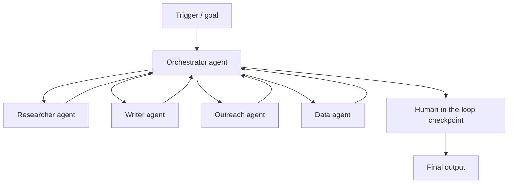

<aside>
🔍

**SEO Package** (remove before publishing)

**Focus Keyword:** agentic workflows in n8n

**Secondary / Semantic:** multi-agent orchestration, AI agent workflow, orchestrator-worker pattern, MCP tools n8n, agent-to-agent (A2A), human-in-the-loop, governance-as-code, autonomous workflow, digital assembly line

**Meta Title:** Agentic Workflows in n8n: Build Multi-Agent Systems 2026 (56 chars)

**Meta Description:** Learn how to build production-grade agentic workflows in n8n: multi-agent orchestration, MCP tools, human-in-the-loop, and governance that survives real workloads. (159 chars)

**Slug:** /blog/agentic-workflows-n8n

**Canonical:** https://aifloxium.online/blog/agentic-workflows-n8n

**Author:** Muhammad Shadab Shams

**Published:** June 16, 2026 · **Last Updated:** June 16, 2026

**Word Count Target:** ~3,500

</aside>

!Agentic workflows and multi-agent orchestration in n8n banner

Agentic workflows and multi-agent orchestration in n8n banner

<aside>
✍️

**Written by Muhammad Shadab Shams** — Software Engineer & AI Automation Expert at AIFLOXIUM. I design and ship production-grade, self-hosted agentic systems on n8n, OpenRouter, and Docker/VPS, with a focus on orchestration, observability, and governance. Everything below comes from building multi-agent workflows that run unattended for real clients.

LinkedIn · X / Twitter · GitHub · aifloxium.online

</aside>

<aside>
⚡

**Short answer:** An agentic workflow is an automation where one or more AI agents plan and act across multiple steps and tools to reach a goal — instead of a fixed, hard-coded sequence. In n8n you build one by combining an **AI Agent node** (the reasoning brain), **tools** it can call (HTTP, MCP, sub-workflows), **memory**, and **human-in-the-loop checkpoints** — then wrapping the whole thing in error handling and governance so it runs safely in production.

</aside>

<aside>
🎯

**Key takeaways**

- 2026's real shift: **workflows matter more than models.** Your edge comes from how you orchestrate agents, not which LLM you pick.
- **Solo agents are out; multi-agent systems are in.** Specialized agents coordinated by an orchestrator beat one giant do-everything prompt.
- **MCP (Model Context Protocol)** is now the universal way to give agents tools — every major AI platform supports it.
- **Governance-as-code and human-in-the-loop** are what separate a demo from a production system.
- n8n is ideal for this because it keeps agents **grounded in deterministic logic** with audit trails and checkpoints.
</aside>

## What this guide covers

- What an agentic workflow actually is (and how it differs from a normal automation)
- Why "workflows matter more than models" is the defining 2026 insight
- The 5 multi-agent orchestration patterns, with when to use each
- A step-by-step build of your first agentic workflow in n8n
- How to give agents tools with **MCP**
- **Human-in-the-loop** and **governance-as-code** for safe autonomy
- A production-readiness checklist, glossary, and FAQ

## Agentic workflows by the numbers (2026)

A few data points that explain why this is the topic of the year:

- The AI agents market is projected to grow from about **$11.5B in 2026 to nearly $295B by 2035** (≈43% CAGR) — agents are the fastest-moving segment in automation.
- **Gartner predicts 40% of enterprise applications will embed task-specific AI agents by the end of 2026**, up from under 5% in 2025.
- Google Cloud's 2026 agent report (3,466 executives) lands on one theme: **competitive advantage comes from agentic workflows — multi-step systems where agents work together — not from owning the best model.**
- Industry consensus for 2026: **solo agents are out, multi-agent systems are in**, and **governance-as-code** is the new must-have.
- MCP, published by Anthropic in late 2024, now sees **90M+ monthly SDK downloads** and is supported by every major AI platform.

> **My take:** The hype says "agents replace work." What I see in production is subtler: agents replace the *glue*. The teams winning in 2026 aren't prompting harder — they're designing reliable assembly lines where each agent does one job well and hands off cleanly.
> 

## What is an agentic workflow?

An agentic workflow is an automation in which an AI agent decides *how* to reach a goal — choosing which tools to call and in what order — rather than following a fixed branch-by-branch script. The workflow gives the agent a goal, a set of tools, and guardrails; the agent does the reasoning in between.

It helps to separate three terms people use interchangeably:

- **AI agent:** a single LLM-driven actor that can reason and call tools to complete a task.
- **Agentic workflow:** the orchestrated system around one or more agents — triggers, tools, memory, checkpoints, and error handling.
- **Multi-agent orchestration:** a pattern where several specialized agents are coordinated (usually by an orchestrator) to handle complex, multi-stage work.

## Why workflows matter more than models

The single most repeated insight in every 2026 trends report is that the model is no longer the moat. Frontier models are converging in capability and getting cheaper every quarter. What you *can't* copy easily is a well-designed workflow: the right decomposition of a problem, the right tools wired in, the right checkpoints, and the reliability scaffolding around it.

This is good news if you're an operator rather than a lab. It means your competitive edge is an engineering and design problem — exactly the kind of thing you can build, version, and improve. n8n leans into this philosophy: anchor AI in predictable logic, add guardrails and human checkpoints, and keep an audit trail.

> **My take:** I've watched teams burn months chasing the "best" model while their workflow stayed brittle. Swap the model and a bad workflow is still bad. Fix the workflow and even a mid-tier model ships reliable results.
> 

## Solo agent vs multi-agent system

| Dimension | Single "do-everything" agent | Multi-agent system |
| --- | --- | --- |
| Prompt complexity | One huge, brittle prompt | Small focused prompts per agent |
| Reliability | Fails in hard-to-debug ways | Isolated, testable components |
| Cost control | Premium model for everything | Cheap models for simple sub-agents |
| Maintainability | One change risks the whole thing | Swap one agent without touching others |
| Best for | Quick prototypes | Production, multi-stage work |

## The 5 multi-agent orchestration patterns

Most real agentic workflows are a combination of these five patterns. Learn them and you can architect almost anything.



1. **Orchestrator-worker:** a lead agent decomposes the goal and delegates to specialist sub-agents, then assembles the result. The workhorse pattern.
2. **Sequential pipeline:** agents run in a fixed order, each refining the previous output (e.g. research → draft → edit).
3. **Parallel fan-out:** multiple agents work simultaneously on independent sub-tasks, then results merge. Fastest for divisible work.
4. **Router / dispatcher:** a lightweight classifier agent routes each request to the right specialist. Great for support and triage.
5. **Hierarchical teams:** orchestrators of orchestrators for very complex domains — use sparingly; complexity compounds.

## Building your first agentic workflow in n8n

Here's the minimum viable production-grade build:

1. **Trigger** — a Chat Trigger, webhook, or schedule kicks off the workflow.
2. **Orchestrator (AI Agent node)** — give it a clear system prompt, a goal, and a list of tools.
3. **Tools** — attach HTTP request tools, sub-workflows (each a specialist agent), and MCP client tools.
4. **Memory** — add a memory node so the agent keeps context across steps.
5. **Human checkpoint** — insert an approval step before any irreversible action.
6. **Error workflow** — wire a global Error Trigger so failures are caught, logged, and retried safely.

A simple router that sends each task to the right specialist sub-agent looks like this:

```jsx
// n8n Code node — route a task to the right specialist agent
const TASKS = {
	research: "agent_researcher",
	write:    "agent_writer",
	email:    "agent_outreach",
	data:     "agent_analyst",
};

const intent = ($json.intent || "research").toLowerCase();
const target = TASKS[intent] || TASKS.research;

return [{ json: { route: target, intent, payload: $json.payload } }];
```

Each `agent_*` is its own n8n sub-workflow with a focused prompt and a narrow toolset — that's the orchestrator-worker pattern in practice.

## Giving agents tools with MCP

The Model Context Protocol (MCP) is the standard that lets agents discover and call external tools without a custom integration for each one — it solves the N×M integration problem. In 2026 it's the default way to connect agents to your data and systems, and n8n supports both consuming MCP servers (MCP Client Tool) and exposing workflows as MCP servers (MCP Server Trigger).

A typical MCP client tool config inside an agentic workflow:

```json
{
  "node": "MCP Client Tool",
  "transport": "http-sse",
  "serverUrl": "https://mcp.yourdomain.com/sse",
  "auth": { "type": "bearer", "tokenEnv": "MCP_TOKEN" },
  "exposedTools": ["search_docs", "create_ticket", "lookup_order"]
}
```

> **My take:** MCP is the best thing to happen to agent tooling, but it widened the attack surface fast. Always scope tokens, prefer read-only tools by default, and never expose a destructive tool without a human checkpoint in front of it.
> 

## Human-in-the-loop and governance-as-code

Autonomy without oversight is how agents make expensive mistakes. n8n's human-in-the-loop nodes let an agent pause and request approval — through Slack, Telegram, email, or chat — before executing a sensitive tool call. The reviewer approves or denies; the agent proceeds or is told no.

**Governance-as-code** means encoding your rules directly into the workflow rather than trusting the model to behave:

- Approval gates before irreversible actions (payments, sends, deletes).
- Allow-lists for which tools each agent may call.
- Spend caps and rate limits per run.
- Full audit logging of every agent decision and tool call.

> **My take:** "The absence of governance is more dangerous than the absence of automation." Every agentic workflow I ship to a client has approval gates and audit logging from day one — it's non-negotiable for B2B.
> 

## Making agentic workflows production-grade

The gap between a viral demo and a system you can leave running is reliability. Two companion disciplines matter most:

- **Self-healing:** retries with backoff, idempotency, compensating actions, and a global error workflow so a single flaky API call doesn't kill the run. I cover this in depth in Self-Healing n8n Workflows.
- **Cost control:** route simple sub-agents to cheap or free models, batch where possible, and cache static context. Full breakdown in AI Automation Cost Optimization.

## Naive vs production-grade agentic workflow

| Aspect | Naive build | Production-grade build |
| --- | --- | --- |
| Architecture | One mega-agent | Orchestrator + specialists |
| Tools | Hard-coded HTTP calls | MCP tools, scoped + read-only by default |
| Oversight | Fully autonomous, no brakes | Human checkpoints on risky actions |
| Failure handling | Crashes on first error | Error workflow + retries + idempotency |
| Governance | Trust the prompt | Allow-lists, spend caps, audit logs |
| Observability | No idea what happened | Every decision + tool call logged |

## My production agentic stack

For AIFLOXIUM client builds my default is: **self-hosted n8n on Docker/VPS** for control and flat cost, an **orchestrator AI Agent node** delegating to focused sub-workflow agents, **OpenRouter** as the model gateway so each agent uses the cheapest capable model, **MCP client tools** (scoped, read-only by default) for integrations, **memory** for context, **human-in-the-loop** approval on anything irreversible, and a **global error workflow plus audit logging** wrapping everything. Predictable, debuggable, and safe to leave running.

## Case study: a 4-agent content pipeline

*Representative example based on a typical AIFLOXIUM build; details anonymized.*

A content-marketing client needed to turn a single brief into a researched, drafted, and scheduled post without a human babysitting each step. The agentic workflow:

| Agent | Job | Model tier |
| --- | --- | --- |
| Orchestrator | Plans steps, delegates, assembles | Premium |
| Researcher | Gathers sources via MCP search tool | Mid-tier |
| Writer | Drafts the post from the research | Premium |
| Editor / QA | Fact-checks, scores, flags for review | Cheap |

A human approves the draft (human-in-the-loop) before the orchestrator schedules it. **Result: a 3-hour manual process collapsed to about 12 minutes of agent time plus a 2-minute human approval**, with full audit logs of every step. Mixing model tiers across agents kept per-run cost low without hurting the final quality.

> **My take:** Notice the QA agent runs on a cheap model. You don't need a flagship to check "did the writer cite a source and stay on brief?" Right-sizing each agent is where multi-agent systems quietly save money.
> 

## Agentic workflow readiness checklist

- [ ]  Goal and success criteria are written down before building
- [ ]  Work is decomposed into focused specialist agents (no mega-prompt)
- [ ]  An orchestrator coordinates and assembles results
- [ ]  Each agent uses the cheapest model that does its job well
- [ ]  Tools are scoped, read-only by default, destructive tools gated
- [ ]  Human-in-the-loop approval sits before any irreversible action
- [ ]  Memory is configured so context survives across steps
- [ ]  A global error workflow catches, logs, and retries failures
- [ ]  Idempotency keys prevent double-actions on retries
- [ ]  Every agent decision and tool call is logged for audit
- [ ]  Spend caps / rate limits are set per run

## Key terms (quick reference)

- **AI agent:** an LLM-driven actor that reasons and calls tools to complete a task.
- **Agentic workflow:** the orchestrated system around agents — triggers, tools, memory, checkpoints, error handling.
- **Orchestrator:** the lead agent that decomposes a goal and delegates to specialists.
- **MCP (Model Context Protocol):** the open standard for connecting agents to tools and data without custom integrations.
- **A2A (Agent-to-Agent):** protocols that let agents from different systems coordinate.
- **Human-in-the-loop (HITL):** a checkpoint where a human approves or denies an agent action.
- **Governance-as-code:** encoding rules (allow-lists, caps, approvals) directly into the workflow.
- **Digital assembly line:** a multi-agent pipeline where each agent does one stage of the work.

## Frequently asked questions

**What is an agentic workflow in simple terms?**

It's an automation where an AI agent decides how to reach a goal — picking which tools to use and in what order — instead of following a fixed, pre-wired script. You give it a goal and guardrails; it figures out the steps.

**Is n8n good for building AI agents?**

Yes. n8n is one of the most popular platforms for production agentic workflows because it combines visual building with deterministic logic, native AI Agent and MCP nodes, human-in-the-loop steps, error handling, and audit trails — the things you need to run agents safely.

**What's the difference between an AI agent and an agentic workflow?**

An AI agent is a single reasoning actor. An agentic workflow is the whole system around one or more agents: triggers, tools, memory, human checkpoints, and error handling. The workflow is what makes the agent reliable.

**Do I need multiple agents, or is one enough?**

Start with one for simple tasks. Move to multiple specialized agents when the work has distinct stages, needs different tools, or a single prompt becomes too complex to maintain. Multi-agent systems are more reliable and cheaper to run at scale.

**What is MCP and why does it matter for agents?**

MCP (Model Context Protocol) is the universal standard for giving agents tools and data access. It removes the need to build a custom integration for every tool, and in 2026 it's supported by every major AI platform — making it the default way to extend agents.

**How do I keep an autonomous agent from doing something harmful?**

Use governance-as-code: allow-lists for tools, spend caps, and human-in-the-loop approval before any irreversible action. Default tools to read-only and gate anything destructive behind a human checkpoint.

## Conclusion

Agentic workflows are the defining automation pattern of 2026 — but the winners aren't the people with the fanciest model. They're the ones who decompose work into focused agents, orchestrate them cleanly, give them tools through MCP, and wrap the whole system in human checkpoints and governance. Build it that way in n8n and you get something rare: autonomy you can actually trust in production.

### What to read next

- Self-Healing n8n Workflows: The 2026 Production Playbook — keep your agents reliable
- AI Automation Cost Optimization — keep your agents cheap
- Tools Comparison: Zapier vs Make vs n8n
- n8n AI Agent docs (external)
- n8n human-in-the-loop docs (external)
- MCP documentation (external)

### About the author

Muhammad Shadab Shams is a Software Engineer and AI Automation Expert at AIFLOXIUM, where he builds self-hosted, observable agentic systems for B2B operators. He writes about n8n, agentic AI, and production-grade automation at aifloxium.online.

*Written by Muhammad Shadab Shams · AI Automation Consultant · aifloxium.online · ApePublish · X @ShadabLoveAi*

<aside>
🧪

**How this guide was built:** The patterns here come from real production n8n agentic builds at AIFLOXIUM, cross-checked against June 2026 industry reports (Google Cloud, Gartner, UiPath) and current n8n + MCP documentation. Market figures and capabilities reflect mid-2026 — re-verify against current sources before relying on them.

</aside>

## Structured data for rich results (remove before publishing)

Paste this JSON-LD into your published page's head so Google and AI answer engines parse the article and FAQ as structured entities (Notion can't render it):

```json
{
  "@context": "https://schema.org",
  "@graph": [
    {
      "@type": "Article",
      "headline": "Agentic Workflows in n8n: How to Build Production-Grade Multi-Agent Systems in 2026",
      "description": "Learn how to build production-grade agentic workflows in n8n: multi-agent orchestration, MCP tools, human-in-the-loop, and governance.",
      "author": {
        "@type": "Person",
        "name": "Muhammad Shadab Shams",
        "url": "https://aifloxium.online",
        "sameAs": [
          "https://www.linkedin.com/in/muhammad-shadab-shams-8b07132b6/",
          "https://x.com/ShadabLoveAi",
          "https://github.com/shamsdev"
        ]
      },
      "publisher": {
        "@type": "Organization",
        "name": "AIFLOXIUM",
        "url": "https://aifloxium.online"
      },
      "datePublished": "2026-06-16",
      "dateModified": "2026-06-16",
      "mainEntityOfPage": "https://aifloxium.online/blog/agentic-workflows-n8n"
    },
    {
      "@type": "FAQPage",
      "mainEntity": [
        {
          "@type": "Question",
          "name": "What is an agentic workflow in simple terms?",
          "acceptedAnswer": {
            "@type": "Answer",
            "text": "An automation where an AI agent decides how to reach a goal, picking which tools to use and in what order, instead of following a fixed pre-wired script."
          }
        },
        {
          "@type": "Question",
          "name": "Is n8n good for building AI agents?",
          "acceptedAnswer": {
            "@type": "Answer",
            "text": "Yes. n8n combines visual building with deterministic logic, native AI Agent and MCP nodes, human-in-the-loop steps, error handling, and audit trails for safe production agents."
          }
        }
      ]
    }
  ]
}
```

- 🚀 Launch & Off-Page SEO Checklist (remove before publishing)
    
    **On-page technical**
    
    - [ ]  Add the JSON-LD schema above to the page head
    - [ ]  Set focus keyword in H1, first 100 words, one H2, meta title, slug, and image alt
    - [ ]  Compress banner to WebP; add descriptive alt text
    - [ ]  Set canonical URL and Open Graph / Twitter card tags
    - [ ]  Add internal links to/from 3+ related posts
    
    **Indexing**
    
    - [ ]  Submit URL in Google Search Console → Request Indexing
    - [ ]  Update and resubmit XML sitemap
    - [ ]  Confirm robots.txt allows AI crawlers (GPTBot, ClaudeBot, PerplexityBot) for GEO
    - [ ]  Ping IndexNow (Bing) for instant indexing
    
    **Off-page / distribution (day-one push)**
    
    - [ ]  Share on LinkedIn, X, and r/n8n + r/AI_Agents
    - [ ]  Post in the n8n community forum and relevant Discord/Skool groups
    - [ ]  Answer 2–3 related Quora / Reddit questions with a contextual link
    - [ ]  Repurpose into an X thread and a LinkedIn carousel
    - [ ]  Add to your email newsletter
    - [ ]  Build 2–3 contextual backlinks from guest posts or directories
    - [ ]  Add UTM parameters to all shared links
    
    **AEO / GEO**
    
    - [ ]  Confirm the one-sentence answer sits in the first 30% of the page
    - [ ]  Verify FAQ and tables render cleanly (LLM-citation formats)
    - [ ]  Add author entity markup (sameAs links to LinkedIn/X/GitHub)